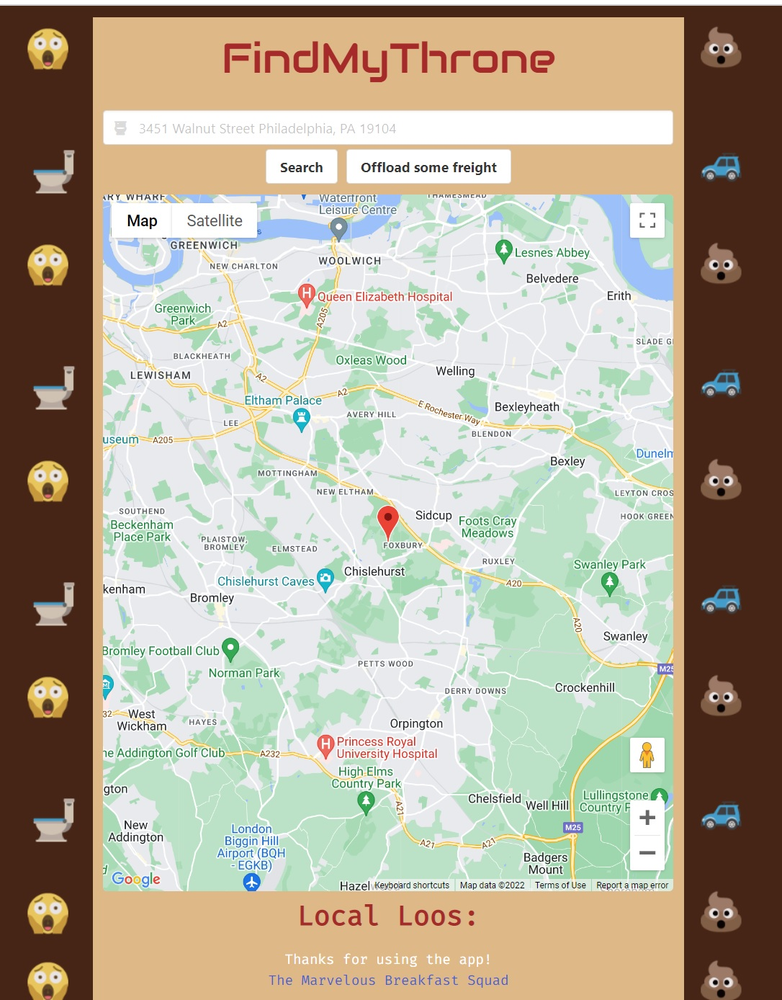
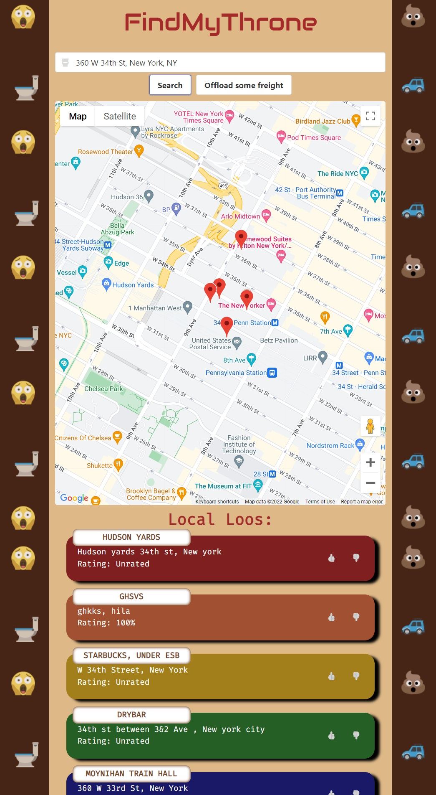
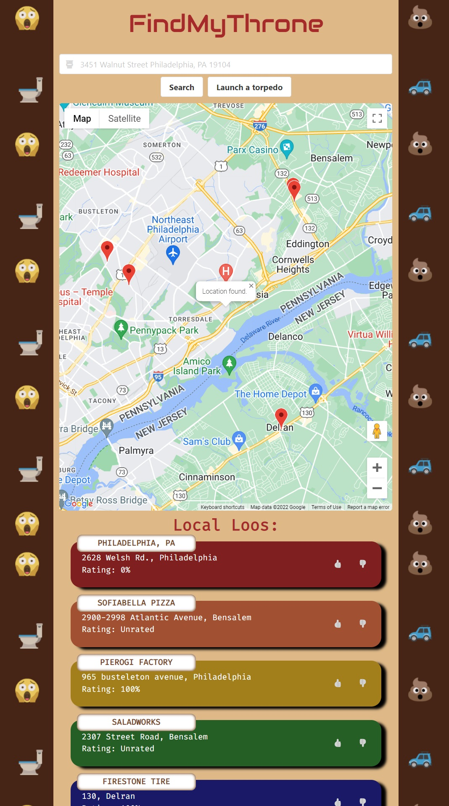
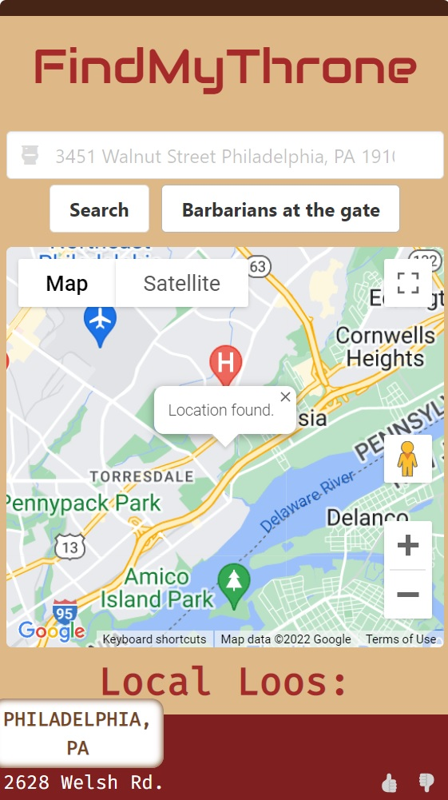

# FindMyThrone

An application that will utilize the Google Maps APi and RefugeRestroom together to display a map and list of nearby public bathrooms. It will also allow for the ability to upvote and downvote locations.

**User Story**
```
AS A traveler
I WANT to see nearby bathrooms
SO THAT I can plan a trip to the bathroom accordingly
```

**Acceptance Criteria**
```
GIVEN a map display with form inputs
WHEN I search for a location
THEN I am presented with a list of the closest five public restrooms and a map of the area
WHEN I view the bathroom locations
THEN I am presented with the name, location, current rating, and icons to up or downvote the location.
WHEN I upvote or downvote a location
THEN I am presented with a color that indicates my selection
WHEN I view places I have viewed before
THEN I am presented with my voting history
```

---

## Authors

- [@Michael Melanson](https://github.com/mmelan000)
- [@Frank Winkler](https://github.com/FWinkler3)
- [@Jesse Ashford](https://github.com/Jesse115)
- [@Ahmadu Jalloh](https://github.com/Ajalloh1)

---

## Screenshots

**Landing Page**



**Search By Address**



**Search By GeoLocation**



**Mobile View**



---

## Technology

 - HTML
 - CSS
 - JavaScript
 - Bulma
 - Google Maps
 - Google Maps API
 - Refuge Restroom API

---

## Optimizations

- Supports multiple search types.
- Mobile friendly.
- Stores users up and down votes.
- GeoLocate button for nearby bathrooms.

---

## Deployment

https://mmelan000.github.io/marvelous-breakfast-squad/

---
